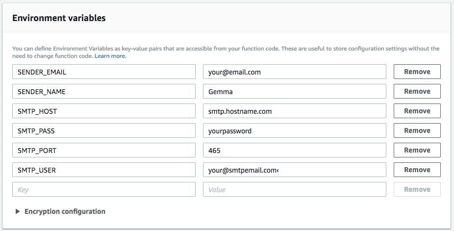

<p align="center">coming soon</p>

<h1 align="center">
  <a href="https://github.com/gemmadlou/maildom"></a>
  <br>
</h1>

<div align="center">

[](https://travis-ci.org/gemmadlou/maildom)  [](https://codeclimate.com/github/gemmadlou/maildom/maintainability) [](https://codecov.io/gh/gemmadlou/maildom)

</div>

<h4 align="center">A serverless Nodejs SMTP email service using AWS Lambda & API Gateway.</a>

## Motivation

When working with <a href="https://jamstack.org/" target="_blank">Jamstack</a> or static html websites, additional functionality like
sending off emails require a server or at least, <a href="https://mailchimp.com/features/landing-pages/" target="__blank">SaaS</a>.

If all you want is an endpoint that takes a few fields and sends off an email, it's a nice alternative that doesn't require the maintenance of a server.

## Is it ready for production?

TLDR, I wish, but no.

You can take it and build on it if you like though.

**What still needs doing?** [Read here](#todo)

## How to use it

Clone this repository and follow the "Get set up" guide.

## Pre-requisites

* [Serverless](https://serverless.com/framework/docs/getting-started/) (version ^1.27.3)
* Node (version 8)
* NPM
* AWS Account (with IAM access)  
  
  You will IAM credentials configured with AWS. You can use serverless to set these up:

  ```shell
  serverless config credentials --provider aws --key XXXXXXX --secret XXXXXXX
  ```
  
  If you have more than 1 set of credentials, you can create a new custom profile the Serverless way.

  ```shell
  serverless config credentials --provider aws --key XXXXXXX --secret XXXXXXX --profile XXXXXXX
  ```
* SMTP Email 
  ([Using a fake SMTP email for testing](#testing-locally))

## Get set up

* In the serverless.yml
  * Set the service name
  * Change the function name to be more relevant
  * Set your profile name or remove if irrelevant

## Testing locally

If you want to get testing with SMTP fast and don't yet have your own credentials, get a fake test email using the Ethereal Email service:

https://ethereal.email/

```shell
SMTP_USER=someusername \
SMTP_PASS=somepassword \
SMTP_HOST=smtp.ethereal.email \
SENDER_NAME=Thomas \
SENDER_EMAIL=the@tankengine.com \
node -e 'require("./handler").email({body: "{\"email\": \"123@abc.com\", \"subject\":\"What a wonderful world\", \"content\": \"Two little birds\\r\\nCame to my doorstep\"}"}, {}, () => {})'
```

## Deploying

```
serverless deploy
```

## Configure environment variables in AWS

Log into AWS

Go into the AWS Lambda panel

Go the deployed function

Add the environment variables



#### Variabales

SENDER_EMAIL

SENDER_NAME

SMTP_HOST

SMTP_PASS

SMTP_PORT

SMTP_USER

## API

```json
{
	"email": "you@you.com",
	"subject": "Maildom",
	"content": "Hi world!\n\rMaildom here"
}
```

## ToDo

- [ ] 100% Code coverage
- [x] Send query parameters
- [x] Use AWS Environment variables to set smtp information
- [ ] Unhappy paths especially for nicer error responses
- [ ] Dynamic variables in serverless.yml to make it multi-environment friendly and reusable across multiple projects

## Roadmap

- [ ] An easy npm installation of the lambda service
- [ ] Optional re-captcha
- [ ] HTML Email

## Credits

* [Nodemailer](https://github.com/nodemailer/nodemailer)
* [Serverless](https://serverless.com)
* [Jest](https://facebook.github.io/jest/)
* [Canva](https://www.canva.com/)
* [Postman](https://www.getpostman.com/)
* [Awesome Readme](https://github.com/matiassingers/awesome-readme)

## License

[GPLv2.1](https://github.com/gemmadlou/maildom/blob/master/LICENSE)

> Here's a nice 4 minute [explanation](https://www.youtube.com/watch?v=JlIrSMzF8T4) of the difference between GPL and the Lesser GPL. This library uses the Lesser GPL.

## Author

Gemma Black

Twitter: <a href="https://twitter.com/GemmaBlackUK" target="_blank">@GemmaBlackUk</a>